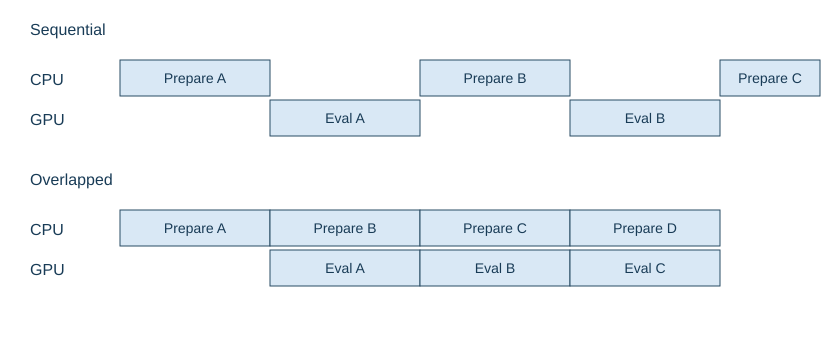
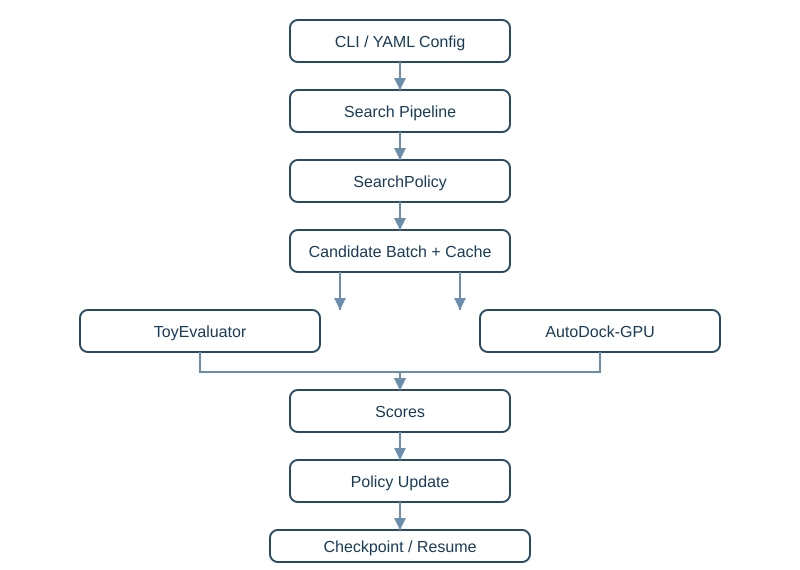
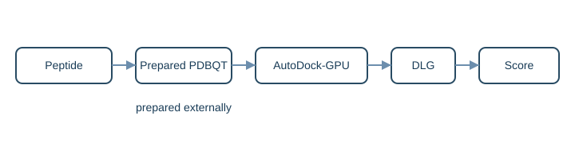
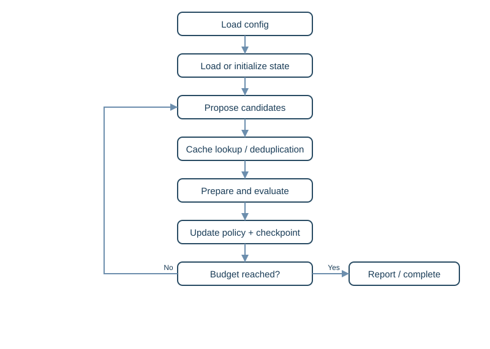
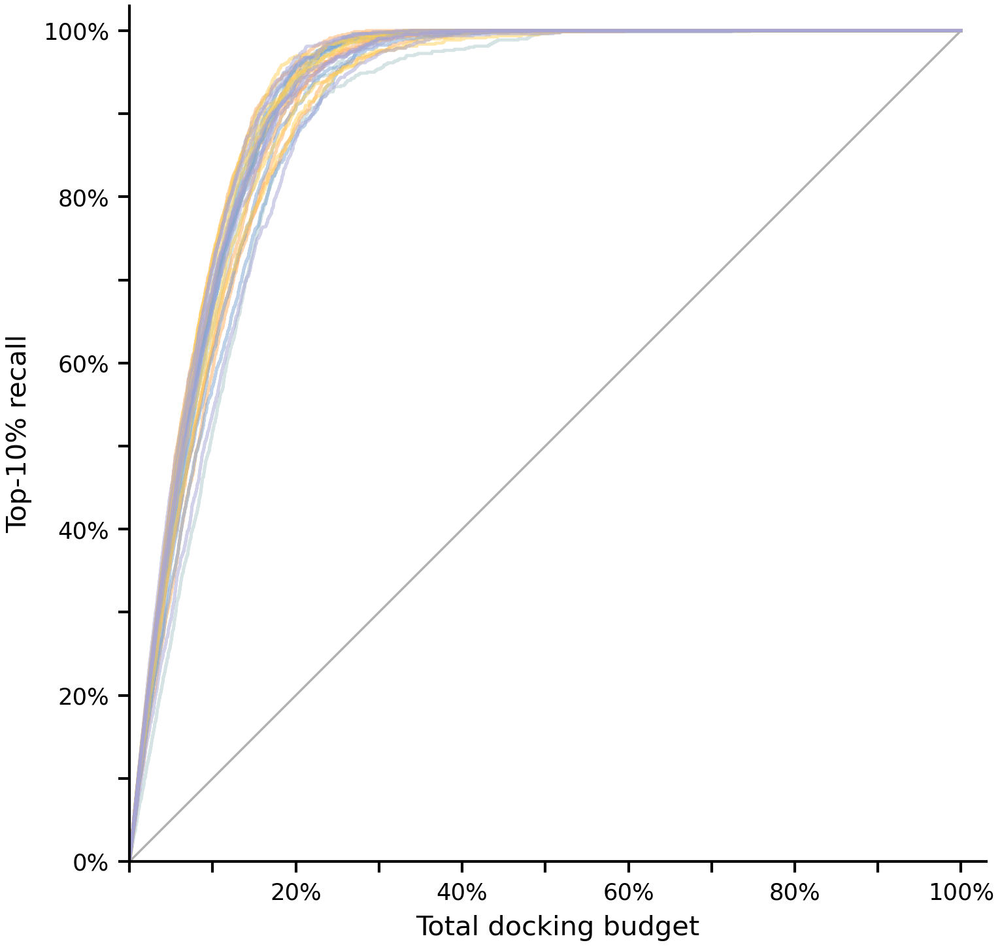

# RLPD

**Budget-aware peptide sequence search for expensive black-box molecular evaluation.**

> [!IMPORTANT]
> **Public Release**
>
> This repository is the public release of RLPD. The core research algorithm and its key implementation details are not included while the associated work remains unpublished.
>
> Tuned experimental parameters, molecular targets, candidate peptides, docking outputs, and raw benchmark data are also kept private.
>
> The repository provides a standalone, runnable implementation of the public software architecture, interfaces, demonstration search policies, evaluator integration, and execution pipeline. It should not be interpreted as the complete implementation used in the unpublished research.

> [!IMPORTANT]
> **公开版本**
>
> 本仓库是 RLPD 的公开版本。在相关研究尚未发表期间，RLPD 的主要研究算法及其关键实现细节不在本仓库中公开。
>
> 调优后的实验参数、真实分子靶点、候选多肽、Docking 输出和原始 Benchmark 数据同样保持私有。
>
> 本仓库提供可以独立安装和运行的公开软件架构、接口、演示性搜索策略、评价器集成和执行流程，但不应被视为未发表研究所使用完整实现的公开副本。

## Overview

Peptide sequence spaces grow exponentially. With a 20-symbol alphabet, lengths 3, 4, and 5 contain 8,000, 160,000, and 3,200,000 sequences. Molecular evaluation is expensive, so evaluating every sequence is often impractical. RLPD separates search decisions from evaluation and runs a reproducible search under an explicit evaluation budget.

## Design

### Policy / Evaluator Separation

`SearchPolicy` proposes and updates candidate search decisions. `Evaluator` assigns scores. The same pipeline can use deterministic `ToyEvaluator` locally or the `AutoDock-GPU` adapter for external molecular evaluation.

### Evaluation Cache

An evaluated sequence is read directly from the signature-bound score cache before evaluation. Cache hits never call the expensive evaluator; incompatible cache configurations are rejected.

### Checkpoint / Resume

The pipeline writes evaluated sequences, pending work, step count, status, cache data, and run metadata. An interrupted task can continue from its checkpoint, and candidates already in the cache are not evaluated again.

### CPU/GPU Overlap

Serial execution is `CPU prepare Batch N → GPU evaluate Batch N → CPU prepare Batch N+1 → GPU evaluate Batch N+1`; the GPU waits during CPU preparation. In the overlap design, `GPU evaluation(N) || CPU preparation(N+1)`. While the GPU evaluates the current batch, a CPU worker prepares the next batch. This reduces evaluator idle time without launching concurrent docking jobs on the same GPU. It targets lower pipeline waiting time, better expensive-evaluator utilization, and shorter wall-clock execution time; no unmeasured speedup is claimed.



## Architecture



The CLI loads YAML into `Config`. The pipeline creates a `PeptideSpace`, selects a public `SearchPolicy`, filters cached sequences, prepares batches, and sends them to an `Evaluator`. Scores update policy state and are written with a `Checkpoint`. See [architecture](docs/architecture.md).

## Features

- configurable peptide sequence spaces
- pluggable public search policies
- deterministic synthetic evaluation
- optional AutoDock-GPU integration
- persistent score cache
- checkpoint/resume
- CPU/GPU overlap scheduling
- reproducible seeded execution
- CLI and YAML configuration
- automated tests and CI

## Installation

```text
python -m pip install -e .
```

## Quick Start

```text
rlpd --version
rlpd demo --config examples/toy_config.yaml
rlpd run --config examples/toy_config.yaml
```

The example writes `work/toy/cache.json`, `work/toy/checkpoint.json`, and `work/toy/run_metadata.json`. Running it again resumes from those files. Public example values are demonstration settings, not tuned parameters from unpublished experiments.

## Toy Evaluator

`ToyEvaluator` produces deterministic synthetic scores from a seed and sequence, so the complete search flow runs without molecular docking software.

## Search Policies

`RandomMutationPolicy` selects a parent, changes one position, and prevents duplicates. `VanillaUCBPolicy` uses textbook UCB1 node selection with ordinary single-position mutation. Neither policy contains research-specific position or residue learning.

## AutoDock-GPU Integration

`AutoDockGPUEvaluator` accepts externally prepared PDBQT inputs from the configured ligand directory, invokes one evaluator stream with the configured receptor FLD, and parses generic DLG energy lines. Existing DLG files are reused only when continuing from a compatible checkpoint. A new run, including a run with no compatible checkpoint, does not reuse stale DLG files. The public evaluator interface uses a higher-is-better score convention. AutoDock-GPU binding energies are negated when converted to search scores.



## Workflow



Load configuration, restore or initialize state, propose candidates, perform cache lookup and deduplication, prepare and evaluate a batch, update the public policy, save a checkpoint, and continue until the budget is reached.

## Research Benchmark

Across the current internal benchmark set, at 20% of the exhaustive evaluation budget, corresponding to an 80% reduction in evaluations, RLPD achieved a 92.98% recall of candidates ranked in the top 10% by exhaustive evaluation.

The 92.98% value is the current aggregate benchmark result.



## Repository Structure

```text
rlpd/                 public implementation
rlpd/policies/        demonstration search policies
rlpd/evaluators/      synthetic and AutoDock-GPU evaluators
rlpd/pipeline/        runner, checkpoint, state, scheduler
examples/             runnable YAML configurations
docs/                 architecture, design, boundary, and SVG assets
tests/                behavior tests
.github/workflows/    Python 3.10–3.12 CI
```

## Testing

```text
python -m compileall rlpd
pytest -q
```

Tests cover sequence validation, deterministic evaluation, cache persistence, checkpoint round trips, budget stopping, resume without duplicate evaluation, both public policies, CLI execution, and scheduler overlap with a single evaluator stream. No GPU is required.

## Public and Research Boundary

The public repository includes:

- runnable public software architecture
- `SearchPolicy` and `Evaluator` interfaces
- demonstration search policies
- deterministic synthetic evaluation
- generic AutoDock-GPU integration
- evaluation cache
- checkpoint/resume
- CPU/GPU overlap scheduling
- CLI and configuration
- tests and documentation

The following research components remain private while the work is unpublished:

- the core RLPD research algorithm and its key implementation details
- research-specific initialization and candidate-selection logic
- tuned experimental parameters
- actual molecular targets
- actual peptide candidates and hits
- docking outputs
- raw research benchmark data

The public code does not describe how the private research components work.

## Status

Research manuscript: in preparation. Public repository: active public release.

## Usage and Rights

No open-source license is currently granted. All rights are reserved.

---

# 中文版本

> [!IMPORTANT]
> **公开版本**
>
> 本仓库是 RLPD 的公开版本。在相关研究尚未发表期间，RLPD 的主要研究算法及其关键实现细节不在本仓库中公开。
>
> 调优后的实验参数、真实分子靶点、候选多肽、Docking 输出和原始 Benchmark 数据同样保持私有。
>
> 本仓库提供可以独立安装和运行的公开软件架构、接口、演示性搜索策略、评价器集成和执行流程，但不应被视为未发表研究所使用完整实现的公开副本。

## 项目概述

多肽序列空间会指数增长。20 种符号的空间在长度为 3、4、5 时分别包含 8,000、160,000 和 3,200,000 个序列。分子评价成本较高，通常不适合评价全部序列。RLPD 将搜索决策与评价过程解耦，在明确的评价预算下运行可复现搜索。

## 设计

### SearchPolicy 与 Evaluator 解耦

`SearchPolicy` 负责提出和更新候选搜索决策，`Evaluator` 负责分配分数。因此同一流程可以使用确定性的 `ToyEvaluator` 本地运行，也可以使用 `AutoDock-GPU` 适配器进行外部分子评价。

### 评价缓存

已经评价过的序列会在评价前从绑定配置签名的 score cache 读取。命中缓存时不会调用昂贵评价器；配置不兼容的缓存会被拒绝。

### Checkpoint 与断点续跑

流程会写入已评价序列、待处理任务、步骤数、状态、缓存数据和运行元数据。任务中断后可以从 checkpoint 继续，缓存中已有的候选不会再次评价。

### CPU/GPU 重叠流水线

串行流程是 `CPU 准备 Batch N → GPU 评价 Batch N → CPU 准备 Batch N+1 → GPU 评价 Batch N+1`，GPU 会在 CPU 准备阶段等待。公开设计使用 `GPU evaluation(N) || CPU preparation(N+1)`。GPU 计算当前批次时，CPU worker 同时准备下一批候选和评价输入，在不让同一张 GPU 同时运行多个 Docking 任务的前提下减少 GPU 等待时间；没有声称未经测量的具体加速倍数。


## 软件架构


CLI 将 YAML 加载为 `Config`。流程创建 `PeptideSpace`，选择公开的 `SearchPolicy`，过滤缓存序列，准备批次并发送给 `Evaluator`。分数更新策略状态并写入 `Checkpoint`。组件关系见 [architecture](docs/architecture.md)。

## 功能

- 可配置的多肽序列空间
- 可插拔的公开搜索策略
- 确定性的合成评价
- 可选的 AutoDock-GPU 集成
- 持久化 score cache
- Checkpoint / Resume
- CPU/GPU 重叠调度
- 固定种子的可复现执行
- CLI 与 YAML 配置
- 自动化测试与 CI

## 安装

```text
python -m pip install -e .
```

## 快速开始

```text
rlpd --version
rlpd demo --config examples/toy_config.yaml
rlpd run --config examples/toy_config.yaml
```

示例会写入 `work/toy/cache.json`、`work/toy/checkpoint.json` 和 `work/toy/run_metadata.json`。再次运行会从这些文件继续。公开示例参数仅用于演示，不是未发表实验中的调优参数。

## Toy Evaluator

`ToyEvaluator` 根据 seed 和序列生成确定性的合成分数，因此无需分子 Docking 软件即可运行完整搜索流程。

## 搜索策略

`RandomMutationPolicy` 从 parent 中选择序列，随机改变一个位置并防止重复。`VanillaUCBPolicy` 使用教科书式 UCB1 节点选择和普通单位置突变。两者均不包含研究特定的位置或残基学习机制。

## AutoDock-GPU 集成

`AutoDockGPUEvaluator` 从配置的 ligand directory 接受外部准备的 PDBQT 输入，使用配置的 receptor FLD 和单个评价流，并解析通用 DLG energy 行。只有在从兼容的 checkpoint 继续运行时才会复用已有 DLG。新运行以及不存在兼容 checkpoint 的运行不会复用旧 DLG 文件。公开 Evaluator 接口统一采用分数越高越优的约定，AutoDock-GPU 的 binding energy 在进入搜索流程时转换为其相反数。仓库不包含真实靶点文件和靶点特定设置。


## 工作流程


加载配置，恢复或初始化状态，提出候选，执行缓存查询和去重，准备并评价批次，更新公开策略，保存 checkpoint，直到达到预算。

## 科研 Benchmark

在当前内部 Benchmark 的汇总结果中，仅使用 20% 的全空间评价预算，即评价计算量减少 80% 时，RLPD 对全空间评价排名前 10% 候选分子的召回率达到 92.98%。

当前 92.98% 为多次实验汇总后的 Benchmark 结果。


## 仓库结构

```text
rlpd/                 公开实现
rlpd/policies/        演示性搜索策略
rlpd/evaluators/      合成评价器与 AutoDock-GPU 评价器
rlpd/pipeline/        runner、checkpoint、state、scheduler
examples/             可运行的 YAML 配置
docs/                 架构、设计、边界说明和 SVG 图
tests/                行为测试
.github/workflows/    Python 3.10–3.12 CI
```

## 测试

```text
python -m compileall rlpd
pytest -q
```

测试覆盖序列校验、确定性评价、缓存持久化、checkpoint 往返、预算停止、无重复断点续跑、两种公开策略、CLI 执行，以及单评价流下的 scheduler 重叠。无需 GPU。

## 公开版本与科研版本边界

公开仓库包括：

- 可运行的公开软件架构
- `SearchPolicy` 与 `Evaluator` 接口
- 演示性搜索策略
- 确定性的合成评价器
- 通用 AutoDock-GPU 集成
- 评价缓存
- Checkpoint / Resume
- CPU/GPU 重叠调度
- CLI 与配置
- 测试和文档

在研究尚未发表期间，以下内容保持私有：

- RLPD 的主要研究算法及其关键实现细节
- 研究特定的初始化与候选选择逻辑
- 调优后的实验参数
- 真实分子靶点
- 真实候选多肽及命中结果
- Docking 输出
- 原始科研 Benchmark 数据

公开代码不描述这些私有研究组件的内部工作方式。

## 项目状态

研究论文：准备中。公开仓库：持续维护。

## 使用说明与权利保留

当前未授予开源许可证，保留全部权利。
